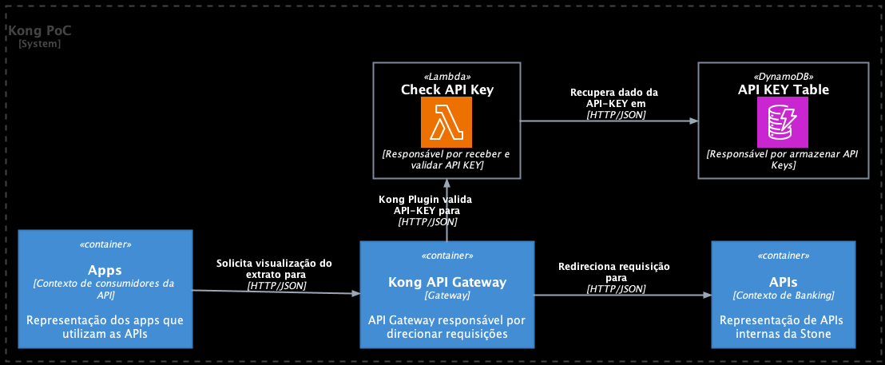

# Escopo
Criação de um Kong Plugin Custom para validar API-KEY enviadas através do header

# Desenho da Solução
<p align="center">
  
</p>

# Executando com Docker
- Para executar o projeto local com docker, devemos utilizar os comandos
   ```
  docker-compose up -d --build
  ```
- Para parar a execução do projeto

  ```
  docker-compose down
  ```

# Exemplos de requisição para testar plugin [Para validar basta mudar o valor do header]
- Mock teste [API de Mock]
```
curl --location 'http://localhost:8000' \
--header 'header_key: 45aabf67-8337-4eb7-8d2c-2cf6b554fbf4'
``````
- Pokemon API
```
curl --location 'http://localhost:8000/pokemon' \
--header 'header_key: 45aabf67-8337-4eb7-8d2c-2cf6b554fbf4'
```
- Github API
```
curl --location 'http://localhost:8000/github' \
--header 'header_key: 45aabf67-8337-4eb7-8d2c-2cf6b554fbf4'
````

